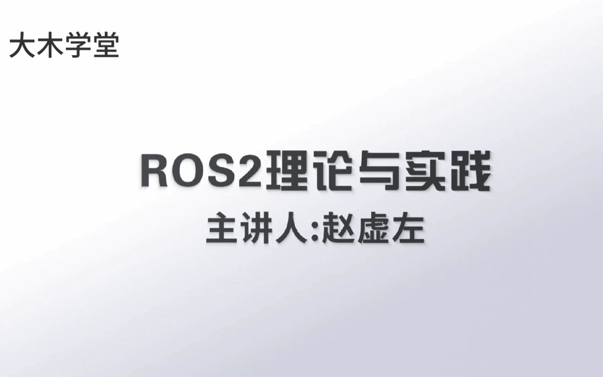

# ROS2 学习

## 说明

对应课程：[赵虚左 - ROS2理论与实践核心篇](https://space.bilibili.com/1101432368/channel/collectiondetail?sid=700208)

仅使用 Git 管理了 src 目录下的源代码，与本地配置相关的开发配置文件、install 目录下的编译结果不做同步。

## 目录

每个 **wsXX_XXX** 为工作空间级目录，**cpp00_xxx** 或 **py00_xxx** 为功能包级目录。

### [ws00_helloworld](ws00_helloworld/) - ROS2 "Hello World" 初体验

- [pkg01_helloworld_cpp](ws00_helloworld/src/pkg01_helloworld_cpp/) - C++ 版 "Hello world"
- [pkg02_helloworld_py](ws00_helloworld/src/pkg02_helloworld_py/) - Python 版 "Hello world"

### [ws01_plumbing](ws01_plumbing/) - 通信机制

- [base_interfaces_demo](ws01_plumbing/src/base_interfaces_demo/) - 存储各种通信接口定义文件的辅助功能包
- [tutorails_plumbing](ws01_plumbing/src/tutorails_plumbing/) - 元功能包
- [cpp01_topic](ws01_plumbing/src/cpp01_topic/) - 话题通信（C++ 实现）
- [py01_topic](ws01_plumbing/src/py01_topic/) - 话题通信（Python 实现）
- [cpp02_service](ws01_plumbing/src/cpp02_service/) - 服务通信（C++ 实现）
- [py02_service](ws01_plumbing/src/py02_service/) - 服务通信（Python 实现）
- [cpp03_action](ws01_plumbing/src/cpp03_action/) - 动作通信（C++ 实现）
- [py03_action](ws01_plumbing/src/py03_action) - 动作通信（Python 实现）
- [cpp04_param](ws01_plumbing/src/cpp04_param/) - 参数服务（C++ 实现）
- [py04_param](ws01_plumbing/src/py04_param/) - 参数服务（Python 实现）
- [cpp05_names](ws01_plumbing/src/cpp05_names/) - 节点命名空间、话题命名空间、话题重命名等（C++）
- [cpp05_names_launch](ws01_plumbing/src/cpp05_names/launch/) - 通过launch文件修改节点、话题名称
- [py05_names](ws01_plumbing/src/py05_names/) - 节点命名空间、话题命名空间、话题重命名等（Python）

### [ws02_time](ws02_time/) - 时间相关 API 的使用

- [cpp01_time](ws02_time/src/cpp01_time) - 时间相关 API（C++）
  - [demo01_time](ws02_time/src/cpp01_time/src/demo01_time.cpp) - Time, Duration
  - [demo02_time_calculation](ws02_time/src/cpp01_time/src/demo02_time_calculation.cpp) - 时间相关的计算
- [py01_time](ws02_time/src/py01_time) - 时间相关 API（Python）
  - [demo01_time_py](ws02_time/src/py01_time/py01_time/demo01_time_py.py) - Time, Duration
  - [demo02_time_calculation](ws02_time/src/py01_time/py01_time/demo02_time_calculation.py) - 时间相关的计算

### [ws03_exercise](ws03_exercise/) - 期中大作业

- [cpp01_topic_exercise](ws03_exercise/src/cpp01_topic_exercise/) - 话题通信案例
- [cpp02_service_exercise](ws03_exercise/src/cpp02_service_exercise/) - 服务通信案例
- [cpp03_action_exercise](ws03_exercise/src/cpp03_action_exercise/) - 动作通信案例
- [cpp04_param_exercise](ws03_exercise/src/cpp04_param_exercise/) - 服务通信案例

### [ws04_tools](ws04_tools/) - launch 与 rosbag2

[py01_launch](ws04_tools/src/py01_launch) - Python 功能包中使用 launch 示例

[cpp01_launch](ws04_tools/src/cpp01_launch) - C++ 功能包中使用 launch 示例

- [Python 版 launch 文件](ws04_tools/src/cpp01_launch/launch/py)
  - [py01_helloworld_launch](ws04_tools/src/cpp01_launch/launch/py/py01_helloworld_launch.py) - launch 基本示例（Python版）
  - [py02_node_launch](ws04_tools/src/cpp01_launch/launch/py/py02_node_launch.py) - Node 节点使用
  - [py03_cmd_launch](ws04_tools/src/cpp01_launch/launch/py/py03_cmd_launch.py) - 执行命令
  - [py04_args_launch](ws04_tools/src/cpp01_launch/launch/py/py04_args_launch.py) - 参数设置
  - [py05_include_launch](ws04_tools/src/cpp01_launch/launch/py/py05_include_launch.py) - 文件包含
  - [py06_group_launch](ws04_tools/src/cpp01_launch/launch/py/py06_group_launch.py) - 分组
- XML 与 yaml 版 launch 文件
  - [xml01_helloworld_launch](ws04_tools/src/cpp01_launch/launch/xml/xml01_helloworld_launch.xml) - launch 基本示例（XML版）
  - [yaml01_helloworld_launch](ws04_tools/src/cpp01_launch/launch/yaml/yaml01_helloworld_launch.yaml) - launch 基本示例（YAML版）
